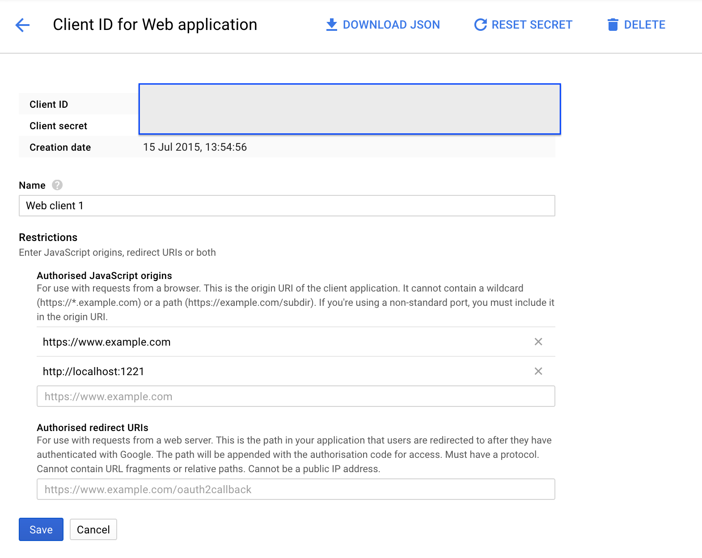

# Talk to me, Google Analytics

A simple Shiny app to display some Google Analytics data, and talk over some statistics of that data, using `googleAnalyticsR` and `googleLanguageR::gl_talk()`

## Install

It needs these libraries:

```r
library(shiny)             # R webapps
library(gentelellaShiny)   # ui theme
library(googleAuthR)       # auth login
library(googleAnalyticsR)  # get google analytics
library(googleLanguageR)   # talking
library(dygraphs)          # plots 
library(xts)               # time-series
```

It needs the CRAN versions of these libraries:

```r
install.packages(c("shiny","googleAnalyticsR", "dygraphs", "xts"))
```
...and the GitHub versions of these:

```r
remotes::install_github("MarkEdmondson1234/googleAuthR")
remotes::install_github("ropensci/googleLanguageR")
remotes::install_github("MarkEdmondson1234/gentelellaShiny")
```

## Auth

You then need authentication setup as per the libraries installation instructions.

* In my Google console set the Authorised JavaScript origins to `http://localhost:1221` and make sure Shiny always launches on that port by setting `options(shiny.port = 1221)` (I have this in my `.Rprofile`)

You set this at this link: `https://console.cloud.google.com/apis/credentials`



This screen also has `Download JSON` at the top which is the client secret used within `GAR_CLIENT_WEB_JSON` below for `gar_set_client()`

For this app in particular I have these environment arguments set in my `.Renviron`:

* `GAR_CLIENT_WEB_JSON` pointing at my download client details (web app) for my project that has Google Analytics and Google Text-to-speech APIs activated for `gar_set_client()`
* Turned off auto auth for `googleAnalyticsR` by commenting out `GA_AUTH_FILE` for `google_analytics()`
* Had my authentication service JSON for cloud platform set in `GL_AUTH` for `gl_talk()`


The JS auth (`gar_auth_jsUI()`) will only work if you are on `http://localhost:1221` and not on `http://127.0.0.1:1221` (the default when launching in RStudio), so change the address in the browser (the are both the same, but Google won't allow ip addresses as a JavaScript origin.)

## Screenshot

